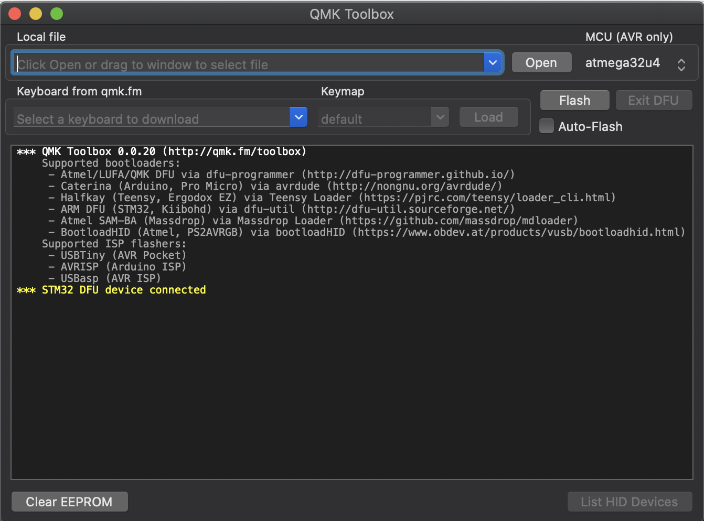
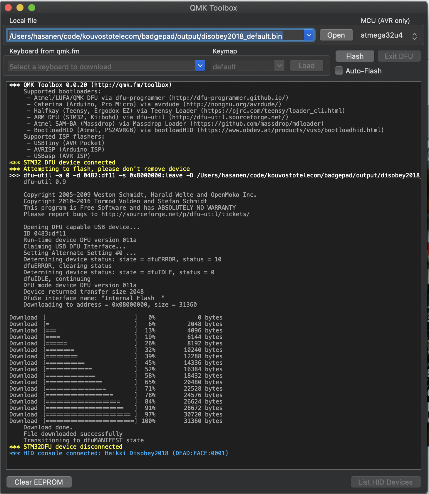

# Firmware

The badge supports [QMK firmware](https://github.com/qmk/qmk_firmware/), which makes the badge to act like a keyboard, instead of a gamepad. You can use `dfu-util`or [QMK Toolbox](https://github.com/qmk/qmk_toolbox) to flash the firmware. Remember that the original firmware for the badge is available at Disobey

## How to flash QMK to Disobey 2018 badge

You need to install Docker! Get Docker from [here](https://docs.docker.com/get-docker/)!

### BadgePad way
1. `git clone https://github.com/KouvostoTelecom/badgepad`
2. Run the Docker setup with `bin/run` command. This generates the binary file, which contains the firmware
3. Short the badge
   1. Make a jumper wire (you can use a small AWG wire or, for example, ESD tweezers)
   2. Connect the middle (5th from left) resistor to get to the bootloader mode to the right side component (3,3V linear voltage regulator). The jump wire should be connected **when powering on the device** (either pressing the `RESET` button, or reconnecting USB-cable while shorting). Otherwise it won't work.
   3.  The three LEDs should be on (see picture below) as a sign that the badge is in bootloader mode and it should show up in the QMK toolbox. 

`STM32 DFU device connected` message refers to the badge being in the bootloader mode.

4. Choose the generated `.bin` file and press `Flash`-button. After this, the device disconnects and reconnects as a keyboard.

5. Reconnect the USB device.
6. ???
7. Profit!